---
title: "FTCL：面向海洋空间计算的异构脚本系统"
subtitle: "Tcl-style CPU/CUDA Hybrid Computational Geometry Scripting System"
author: "房鸿铭 · 软件工程 · 指导教师：纪兆辉"
date: "May 2026"
---

## 研究动机：脚本表达与 GPU 执行之间存在断层

- 脚本语言易于表达算法流程，但通常难以直接组织 GPU 计算。
- CUDA 具有强大并行能力，但内存管理、指针传递和同步细节会抬高使用门槛。
- 本文构建中间层：FTCL script 表达任务，UVec 管理跨设备数据，CPU/CUDA backend 执行计算。
- **Core idea:** scripts express intent, UVec preserves data residency, backends provide execution power.

## 研究对象：FTCL 是什么

- FTCL 是一个 Tcl-style scripting interpreter，以 C++20 实现。
- 支持 variables、procedures、scopes、lists、dictionaries、arrays、expressions、command substitution 和 thread channels。
- 在语言层之上扩展 `geom` command library，使脚本可以调用计算几何算法。
- 通过 UVec 将脚本层数据映射到 CPU 和 CUDA device buffers。

## Research Questions

- **RQ1 Correctness:** FTCL 的 Tcl subset、expression parser 和 command semantics 是否稳定？
- **RQ2 Cross-device consistency:** CPU backend 与 CUDA backend 是否能返回等价 geometry results？
- **RQ3 Performance:** CUDA 何时带来 end-to-end speedup？
- **RQ4 Scalability:** 多张 A800 GPU 能否通过 FTCL script 暴露 weak-scaling 能力？

## 主要贡献

- 设计并实现可扩展的 Tcl-style interpreter，支持并发与测试命令。
- 提出 UVec cross-device vector abstraction，自动维护 CPU/CUDA copy validity。
- 实现 geometry command library，覆盖 scalar algorithms 与 batch algorithms。
- 构建 CPU/GPU equivalence、random differential、edge-case、stress 和 benchmark tests。
- 在 8×A800 server 上完成 single-GPU 与 multi-GPU evaluation。

## 系统总体架构：表达、数据和执行解耦

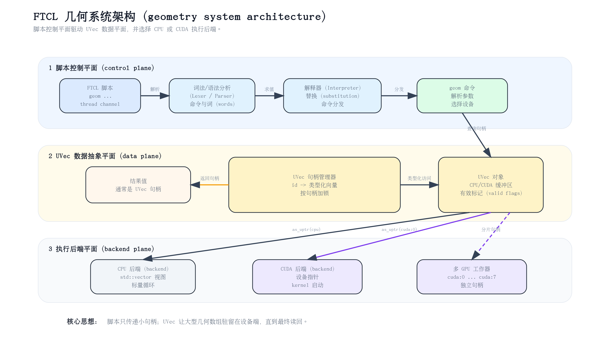{width=95%}

## Interpreter Pipeline：从 script 到 command dispatch

- Lexer 将 source string 转换为 token stream，保留 command boundary、brace、bracket、quote 和 comment。
- Parser 将 tokens 组织为 Script、Command 和 Word。
- Interpreter 对 Word 执行 variable substitution、command substitution、array lookup 和 string concatenation。
- Command dispatcher 将第一个 value 作为 command name，调用 native C++ command function。

## UVec：让 CPU/CUDA 数据同步成为系统责任

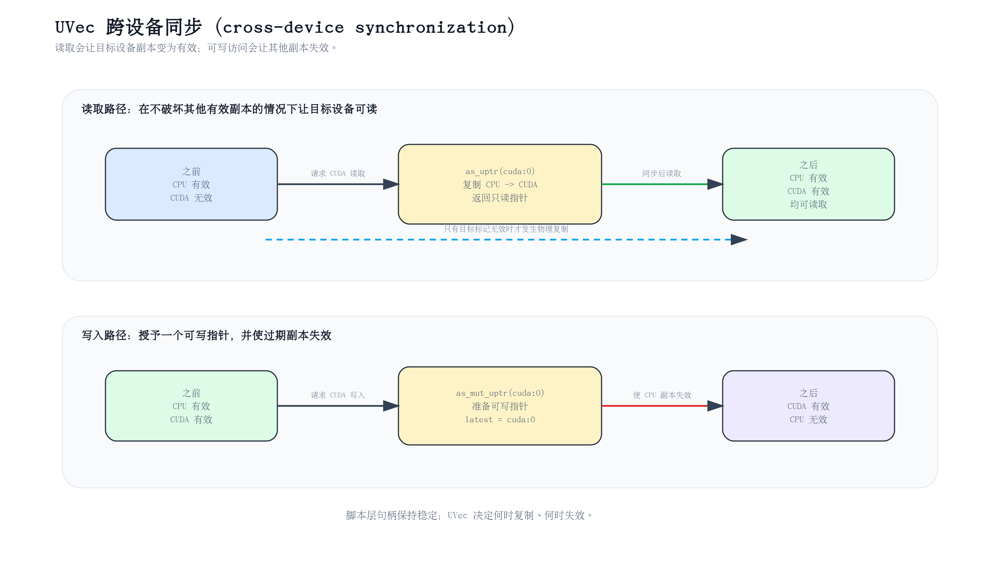{width=92%}

## UVec State Machine：valid flag 驱动自动同步

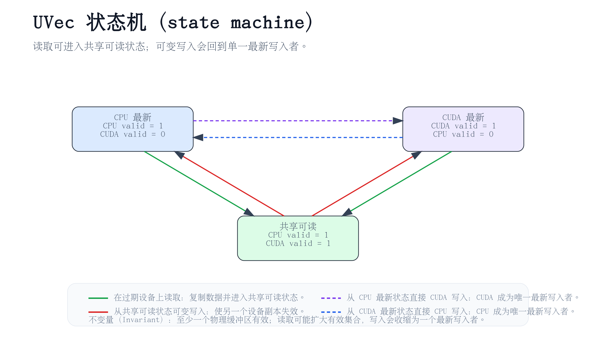{width=78%}

## geom Command Flow：脚本命令如何进入 backend

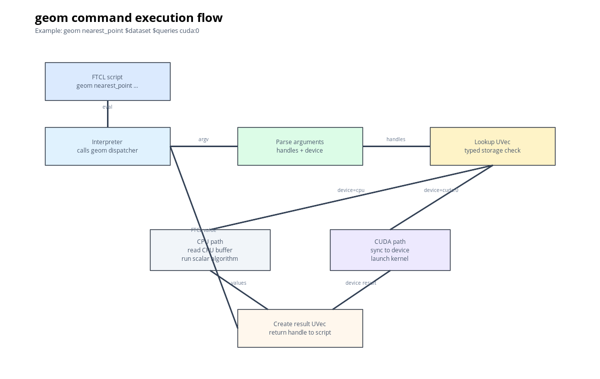{width=92%}

## Geometry Algorithm Library

- Scalar algorithms：distance、orientation、segment intersection、polygon area、point-in-polygon、convex hull。
- Batch algorithms：distance matrix、nearest point、circle range count、AABB collision、transform points、bbox reduce、centroid。
- GPU-friendly workloads 具有大量 independent work items。
- Convex hull 等含排序或栈式结构的算法保留为 CPU-first path。

## Correctness Validation：先正确，再谈加速

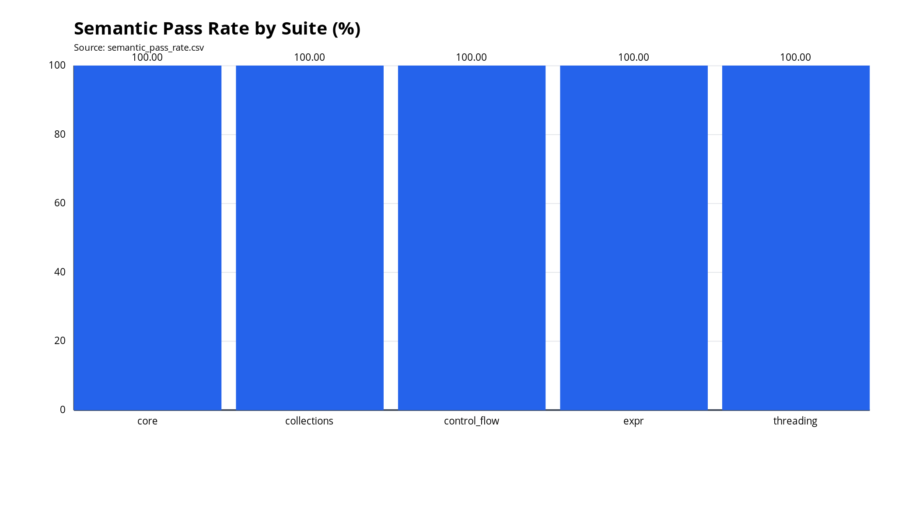{width=76%}

## CPU/GPU Numerical Equivalence：CUDA 结果接近 CPU reference

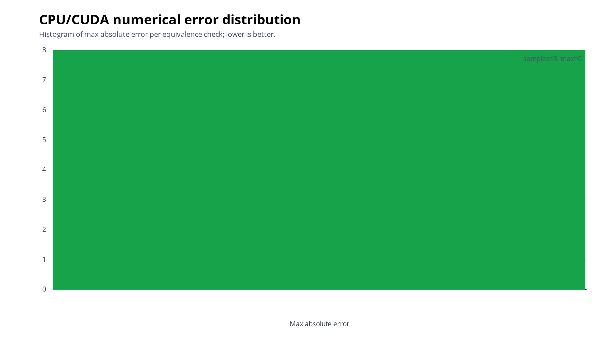{width=72%}

## Single-GPU Performance Scaling：work items 足够多时 CUDA 获益明显

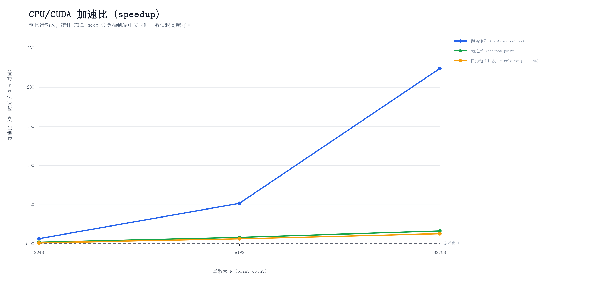{width=84%}

## Throughput：UVec handles 支撑高吞吐脚本流水线

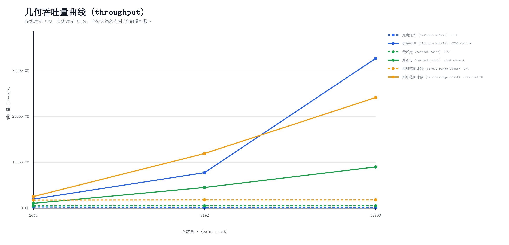{width=84%}

## Multi-GPU Scaling：8×A800 下的 weak-scaling 验证

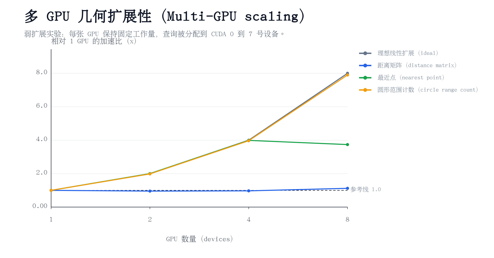{width=84%}

## Break-even Point：CUDA 不是天然更快

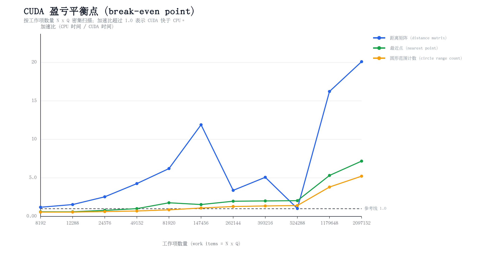{width=84%}

## Concurrency：多 worker 提升吞吐，也带来资源竞争

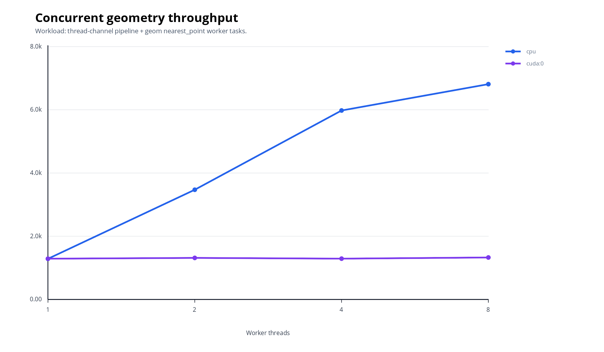{width=78%}

## Ocean-oriented Spatial Computing Demo

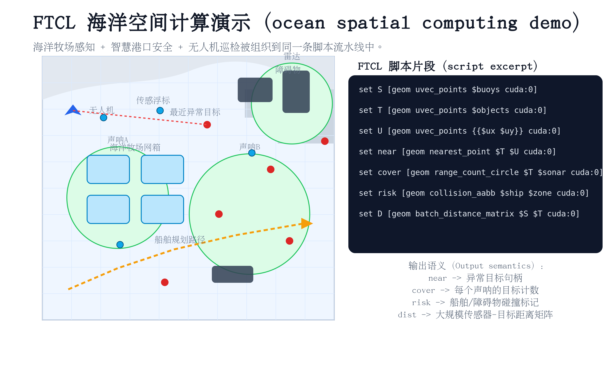{width=84%}

## 为什么这不是普通几何库

- 普通 geometry library 提供 C++ function call。
- FTCL 提供 script-level orchestration：可以组合算法、并发运行、记录实验、复现实验。
- UVec 提供 data residency：中间结果可以停留在 CPU 或 CUDA，不必每一步转回字符串。
- Benchmark pipeline 将 correctness、performance 和 reproducibility 连接起来。

## 局限性与未来工作

- CPU baseline 仍是 scalar backend，未来需要 all-core CPU implementation。
- CUDA backend 需要 memory pools、asynchronous streams 和 persistent output buffers。
- Parser path 可继续向 token-stream parser、AST、bytecode 和 Pratt parser 演进。
- Geometry library 可增加 spatial index、polygon boolean operations 和 dynamic nearest-neighbor search。

## 结论

- FTCL 把脚本表达、跨设备内存、并发执行和几何计算放进了同一个系统。
- UVec 让 CPU/CUDA memory movement 变成系统责任，而不是用户负担。
- GPU acceleration 的关键不是“用了 CUDA”，而是 work-item scale、data residency、output size 和 synchronization cost 的平衡。
- **Final message:** FTCL is a prototype heterogeneous spatial-computing runtime.
